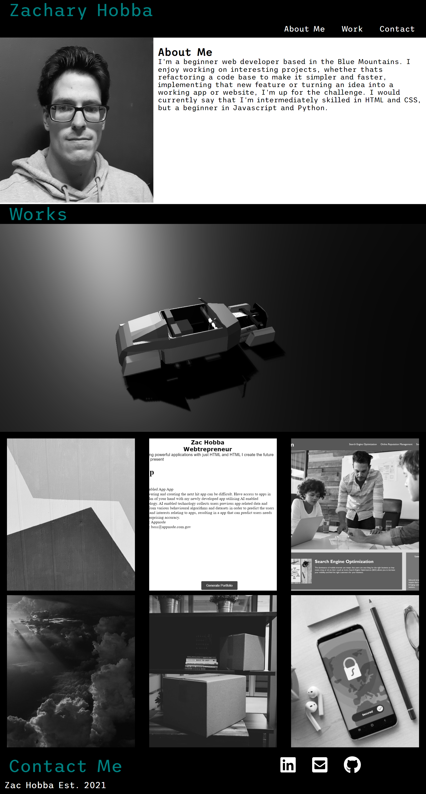

# Portfolio-Website
A website to show my previous projects and expertise as a web developer.

Currently there are 4 projects with placeholder images and text for future projects.

couldn't get the header or contact section exactly the way I wanted but everything else is alright. The contact and header sections didn't go exactly to plan and the website colour scheme and layout could be improved, but I'll improve upon it as I gain more experience.

### Technology Used
- HTML
- CSS: Used media queries and flexbox to control layouts for different screens.

*** Link
https://hobbaz.github.io/Portfolio-Website/
